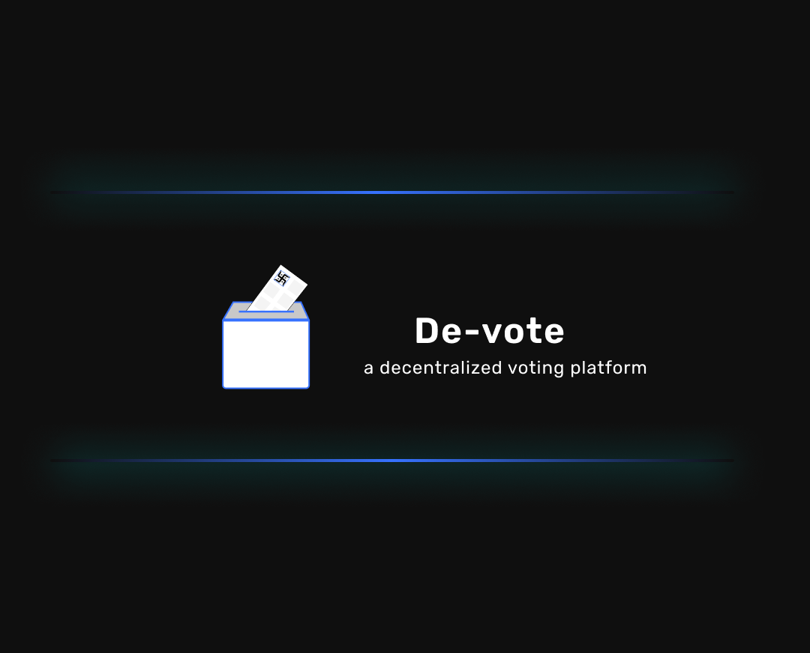

<p align="center">
        
</p>
<h1 align="center" style="border: 0;">De - Vote : Frontend</h1>

  "De-Vote" is the platform that replicate how can government can conduct elections in a safe and fair manner online using Blockchain technology that solves the problem of foreign employeers that are not able to vote in their own country election.


## Run Locally

Clone the project

```bash
  git clone https://github.com/kamal0620040/DeVote.git
```

Go to the project directory

```bash
  cd Devote
```
Install dependencies present in [package.json](https://github.com/kamal0620040/DeVote/blob/master/package.json) file.

```bash
  npm install
```
Now, run the hardhat local network for conneting the wallet

```bash
  npx hardhat node
```

Deploy the smart contract locally by running
Make sure that ether.js package  version in package.json is >6. [only for deploting smart contract]
```bash
  npx hardhat run scripts/deploy.js --network localhost
```

Due to the issue of ether.js function in next.js version >= 13. Before running the project edit package.json and set ether.js version 5.4.2, run npm install and then create server

Finally, you can start the next.js server
```bash
  npm run dev
```


## Tech Stack
Solidity, Next JS, Tailwind CSS, JSX, Ethereum, Hardhat, IPFS, Django